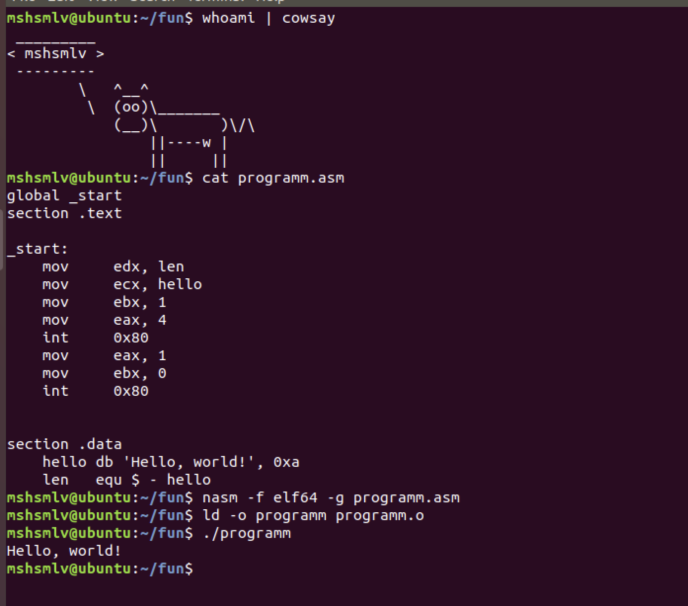
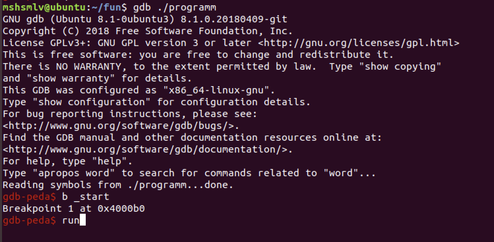
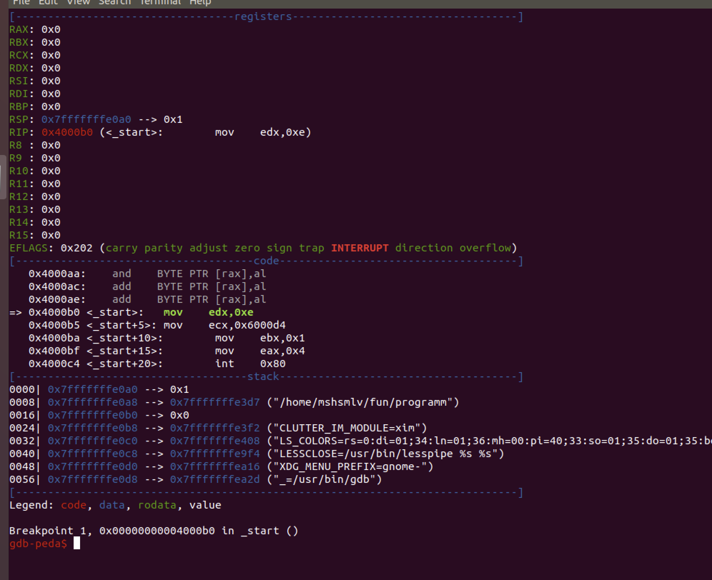

# История. Арихитектура Intel x86. Первые операции nasm.


- [Слайды](https://docs.google.com/presentation/d/1wcDqGwYC3rbJlpSsQzH-h4KJswZaV0V6JdT3Zmw4KSY/edit?usp=sharing)
- [Запись лекции](https://www.youtube.com/watch?v=1Vja2y1lr8s)

## Домашка

1. **Теория 1**
    
    Что случится, если результат сложения не влезет в регистр?
    (Сложения двух чисел, результат сложения которых больше чем 8 байт)

    ```assembly
    mov rax, ffffffffffffffffh
    add rax, 1
    ```

    Ожидаемый формат ответа: объяснение своими словами.

2. **Теория 2**
    
    Что случится, если результат вычитания отрицательный?

    ```assembly
    mov rax, 1
    sub rax, 10
    ```

    Ожидаемый формат ответа: объяснение своими словами.

3. **Лабиринт на пачке хлопьев**

   ```assembly
    mov eax, 10h
    mov ebx, 20h
    mov ecx, 30h

    mov edx, eax
    mov eax, ebx
    mov ebx, ecx
    mov ecx, edx
    mov ecx, eax
    mov eax, edx
    mov edx, ebx
    mov ebx, ecx
    mov ecx, eax
    ``` 
    В каком из регистров eax, ebx, ecx, edx будет лежать наибольшее значение?

    Ожидаемый формат ответа: название регистра.

4. **Настройка машины (Шаги описаны для UBUNTU 18.04)**

   1. Ставим пакет nasm и cowsay
        ```
        sudo apt install nasm cowsay
        ```
    2. Компилируем первую программу.
    
    - Создаем файл в удобном для вас редакторе кода, который поддерживает подстветку синтаксиса ассемблера со следующим содержимым (расширение файла .asm):

        ```
        global _start
        section .text

        _start:
            mov     edx, len   
            mov     ecx, hello
            mov     ebx, 1
            mov     eax, 4
            int     0x80
            mov     eax, 1
            mov     ebx, 0
            int     0x80


        section .data
            hello db 'Hello, world!', 0xa
            len   equ $ - hello
        ```

    - Компилируем! Из папки с файликом запускаем следующие команды:
        ```bash
        nasm -f elf64 -g <filename>.asm #команда компиляция
        ld -o <binary_name> <filename>.o #команда линковки
        ```
    - Запускаем!
       ```
       ./<binary_name>
       ```
    Ожидаемый формат ответа: скриншот вида.

    


5. **Установка отладчика**

    Мы будем пользоваться отладчиком gdb, который в вашей системе вероятно уже стоит. Но для того, чтобы наши программы легче было анализировать, мы поставим расширение [gdb-peda](https://github.com/longld/peda).

    Для этого выполняем следующие команды:

    ```
    git clone https://github.com/longld/peda.git ~/peda
    echo "source ~/peda/peda.py" >> ~/.gdbinit
    ```

    Запускаем отладчик в нашей программе

    ```
    gdb ./programm
    ```

    Отладчик предоставляет свою командную строку (подобие командной строки линукс).

    Выполняем следующие команды отладчика:

    ```bash
    break _start # поставить точку останова на метку _start
    run #запустить программу
    ```

    Что у вас должно получиться:

    


    Ожидаемый формат ответа: скриншот вида.

    

6. Задачка с пары (про 256).

    Результат выполнения следующего кода? Что будет лежать в ячейках памяти 42, 43, 44, 45?

    ```assembly
    mov eax, 42
    mov [eax], 256
    ```

    Ожидаемый формат ответа: объяснение своими словами.